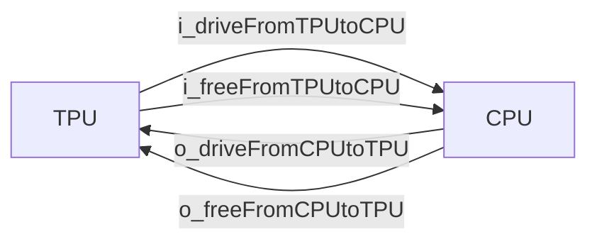
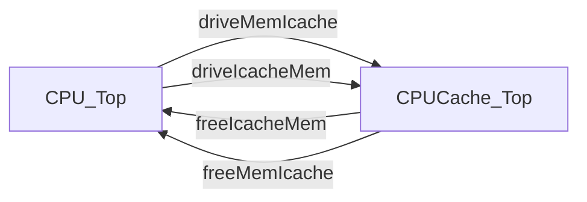
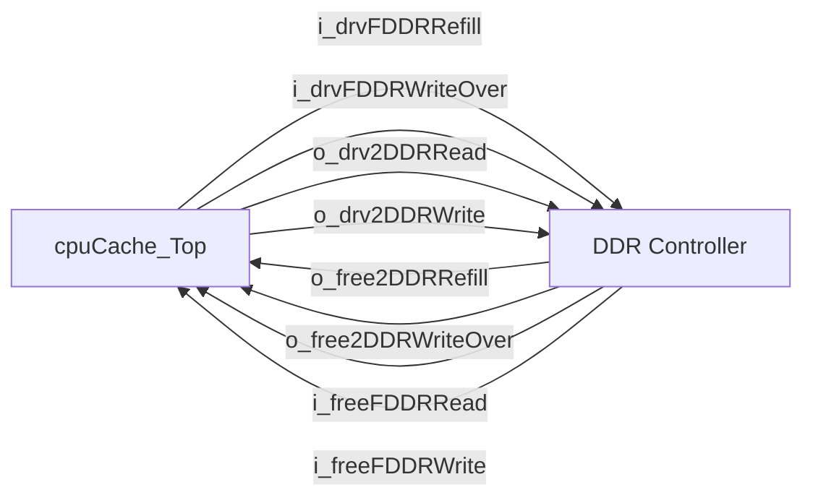

# `CPUwithCache` 代码手册（异步电路 Verilog 项目）

> ✅ **本手册严格基于提供的 JSON 上下文生成，不引入任何外部知识或推测。所有结论均有 JSON 中的字段、连接关系、角色标注（`signal_role`）、模块层级与组件语义支撑。**

---

## 模块概览

`CPUwithCache` 是整个异步 CPU 系统的**顶层集成模块**，其核心职责是：
🔹 **桥接 CPU 核心逻辑（`cpu_top`）与缓存子系统（`cpuCache_top`）**；
🔹 **协调 CPU 与外部加速器（TPU/TS）及内存子系统（DDR）之间的异步事件与数据通路**；
🔹 **提供统一复位（`rst`）与调试开关（`switch`）入口**。

它本身**不实现计算或控制逻辑**，而是作为“胶合层”（glue logic），完成以下关键抽象：

- 将 CPU 内部的 cache 访问请求（`driveFromMemtoIcache/Dcache`）路由至 `cpuCache_top`；
- 将 `cpuCache_top` 返回的 cache 数据/状态（`loadData_256`, `free2LdSt` 等）转交 `cpu_top`；
- 处理跨域握手信号（如 `i_freeFromTPUtoCPU` ↔ `o_freeFromCPUtoTPU`），确保异步域间可靠通信。

> ⚠️ 注意：`cpuCache_top` 在 JSON 中被标记为 `"artifact_kind": "external_dependency"`，且 `target_ref` 为 `null` —— 表明其**RTL 实现未在当前分析范围内**，仅通过端口契约交互。所有关于 I-cache/D-cache 的具体行为（如替换策略、一致性协议）均需查阅其独立文档。

---

## 层级结构

```
CPUwithCache (top)
├── cpu_top (module) —— CPU 核心逻辑（取指/译码/执行/访存/写回）
│   ├── Fetch_top      → 取指前端（含分支预测、指令预取）
│   ├── idu_top        → 译码与寄存器堆（IDU）
│   ├── exe_top        → 执行单元（ALU/AGU/BRU/MUL/DIV/CSR）
│   ├── lsu_top        → 加载存储单元（LSU，含地址生成、内存请求格式化）
│   ├── mem_slot       → 内存请求仲裁与缓冲（Fetch/LSU/Cache 请求多路复用）
│   └── writeBack      → 写回单元（结果分发至 GRF/CSR/Fetch）
└── cpuCache_top (external_dependency) —— 缓存控制器（I-cache + D-cache + DDR 接口）
    ├── I-cache 子模块（端口含 `icache_*`）
    ├── D-cache 子模块（端口含 `dcache_*`）
    └── DDR 接口子模块（端口含 `DDR*`）
```

### 关键事实说明

- `cpu_top` 是**唯一直接实例化的子模块**（`"artifact_kind": "module"`），其内部结构完整可见（含 `Fetch_top`, `exe_top` 等）。
- `cpuCache_top` 是**外部依赖**（`"artifact_kind": "external_dependency"`），JSON 中仅提供其端口连接关系，无内部结构信息。
- 所有 `c*` 组件（如 `cFifo1_cpu`, `cMutexMerge_2_WB`）均为**参数化异步原语（families）的实例**，用于构建握手协议（Handshake Protocol）。

---

## 关键结构子与作用

本系统采用**基于事件驱动的异步流水线架构**，核心通信范式为 `drive` / `free` 握手对。以下结构子是构建该范式的基石：

| 结构子名          | 所属家族       | 核心语义                                                                                                                                                                                                              | 在 `CPUwithCache` 中的关键作用                                                                                                                         |
| ----------------- | -------------- | --------------------------------------------------------------------------------------------------------------------------------------------------------------------------------------------------------------------- | -------------------------------------------------------------------------------------------------------------------------------------------------------- |
| `cFifo1_*`      | `Fifo1`      | **非重入式 FIFO 缓冲**`<br>`• `i_drive` → 触发事务`<br>`• `o_free` → 完成确认`<br>`• `o_driveNext` → 向下游转发`<br>`• `i_freeNext` → 下游完成反馈`<br>`• `o_fire` → 事务就绪标志 | •`cpu_top` 内部各阶段（Fetch→IDU→EXE→LSU→WB）间的数据暂存与背压隔离`<br>`• `mem_slot` 中对 Fetch/LSU 请求的缓冲仲裁                          |
| `cMutexMerge_*` | `MutexMerge` | **互斥合并（环境保证互斥）**`<br>`• 多个 `i_drive[k]` 输入，**仅一个有效**`<br>`• 输出 `o_driveNext` 对应激活输入`<br>`• `o_free[k]` 仅对激活通道反馈                                      | •`Fetch_top`: 合并 TPU/EXCP/WB 的指令注入请求`<br>`• `exe_top`: 合并 ALU/MUL/BRU 等执行单元结果`<br>`• `writeBack`: 合并 LSU/GRF 的写回请求 |
| `cSelSplit_*`   | `SelSplit`   | **条件选择分发**`<br>`• 单 `i_drive` 输入，根据 `valid[k]` 选择输出通道`<br>`• `o_free` 由**所选通道的 `i_free[k]` 触发**                                                                   | •`Fetch_Logic`: 将指令流分发至不同处理路径（如立即数生成、跳转目标计算）`<br>`• `exe_top`: 将执行结果分发至 LSU/GRF/CSR 等目的地                 |
| `cNatSplit_*`   | `NatSplit`   | **广播分发（All-Ack 完成）**`<br>`• 单 `i_drive` 输入，**同时驱动所有下游**`<br>`• `o_free` 需等待**所有 `i_free[k]` 到达**                                                             | •`writeBack`: 将写回结果同时广播至 GRF 和 CSR，并等待双方确认后才释放上游                                                                             |
| `cWaitMerge_*`  | `WaitMerge`  | **全输入同步合并（Join）**`<br>`• 多个 `i_drive[k]` 必须**全部到达**才触发 `o_driveNext<br>`• `i_free[k]` 与 `o_free` **同步广播**                                                      | •`Fetch_top`: 同步 Fetch 与 WB 的指令流（如处理分支延迟槽）`<br>`• `writeBack`: 同步 LSU 与 GRF 的写回完成信号                                   |

> 🔍 **为什么这些结构子如此重要？**它们定义了整个系统的**时序契约（Timing Contract）**：
>
> - `cFifo1` 保证**背压传播**（上游不能发新事务，直到下游 `free`）；
> - `cMutexMerge` 假设**环境无竞争**（简化硬件，但要求软件/上层逻辑避免冲突）；
> - `cSelSplit` / `cNatSplit` / `cWaitMerge` 共同实现**灵活的数据路由与同步模型**，替代传统时钟域交叉（CDC）。
>   **违反任一结构子的契约（如向 `cMutexMerge` 发送两个 `drive`），将导致不可预测行为。**

---

## 事件流（Event Flow）

事件流以 `drive`（发起）和 `free`（完成）信号对为核心，构成闭环握手。以下是 `CPUwithCache` 中最关键的三条事件路径：

### 1. CPU → TPU 事件流（指令/控制下发）



- **语义**：TPU 向 CPU 发起请求（如启动计算），CPU 处理完成后通知 TPU。
- **关键点**：`cpu_top` 直接透传此事件对，未做缓冲或仲裁（无 `cFifo1` 或 `cMutexMerge` 实例）。

### 2. CPU → Cache → Memory 事件流（取指/加载/存储）



- **语义**：`cpu_top` 发出取指请求（`driveFromMemtoIcache`）→ `cpuCache_top` 处理 → 返回数据（`dataIcachetoMem_256`）并发出完成信号（`freeFromIcachetoMem`）→ `cpu_top` 确认后释放资源（`freeFromMemtoIcache`）。
- **关键点**：`w_dataMemtoIcache_136` 被拆分为三段（`stWen_8`, `cpuPA_56`, `stData_64`）送入 `cpuCache_top`，表明 I-cache 请求包含**写使能、物理地址、数据**（可能用于预取或指令填充）。

### 3. Cache → DDR 事件流（Refill/WriteOver）



- **语义**：`cpuCache_top` 主动发起 DDR 操作（Refill 缺页、WriteOver 写穿透、Read/Write 显式访问）。
- **关键点**：`o_readPA_56` / `o_writePA_56` / `o_writeLine_256` 是 DDR 操作的**地址与数据载荷**，由 `cpuCache_top` 生成并驱动。

> 📌 **事件流本质**：所有 `drive`/`free` 信号均遵循**异步握手协议**，无全局时钟。`cpu_top` 内部通过 `cFifo1` 等组件将长路径分割为多个短握手段，提升频率与鲁棒性。

---

## 数据流（Data Flow）

数据流始终与事件流绑定，仅在 `drive` 有效且 `free` 尚未返回时，数据信号才被采样。关键数据通路如下：

| 数据通路                  | 宽度        | 方向     | 来源模块         | 目标模块         | 语义说明                                                                                                                                                                                     |
| ------------------------- | ----------- | -------- | ---------------- | ---------------- | -------------------------------------------------------------------------------------------------------------------------------------------------------------------------------------------- |
| `i_dataTPUtoCPU_80`     | `[79:0]`  | Input    | TPU              | `cpu_top`      | TPU 发送给 CPU 的 80-bit 控制/配置数据（如启动参数、任务描述符）                                                                                                                             |
| `o_dataCPUtoTS_128`     | `[127:0]` | Output   | `cpu_top`      | TS               | CPU 发送给任务调度器（TS）的 128-bit 任务状态/结果数据                                                                                                                                       |
| `w_dataMemtoIcache_136` | `[135:0]` | Internal | `cpu_top`      | `cpuCache_top` | **I-cache 请求包**：`<br>`• `[135:128]`: `stWen_8`（写使能掩码）`<br>`• `[119:64]`: `cpuPA_56`（56-bit 物理地址）`<br>`• `[63:0]`: `stData_64`（64-bit 指令数据） |
| `w_dataIcachetoMem_256` | `[255:0]` | Internal | `cpuCache_top` | `cpu_top`      | **I-cache 响应包**：256-bit 指令行（cache line）数据，供 CPU 解码执行                                                                                                                  |
| `w_dataMemtoDcache_136` | `[135:0]` | Internal | `cpu_top`      | `cpuCache_top` | **D-cache 请求包**：结构同 I-cache，但用于数据读写（`dcache_*` 端口）                                                                                                                |
| `w_dataDcachetoMem_256` | `[255:0]` | Internal | `cpuCache_top` | `cpu_top`      | **D-cache 响应包**：256-bit 数据行（cache line）                                                                                                                                       |
| `i_icache_instData_128` | `[127:0]` | Input    | 外部             | `cpuCache_top` | 外部提供的 128-bit 指令数据（可能用于初始化或调试注入）                                                                                                                                      |
| `i_ddrRefillLine_256`   | `[255:0]` | Input    | DDR              | `cpuCache_top` | DDR 返回的 256-bit 缺页填充数据行                                                                                                                                                            |

> 💡 **数据宽度设计洞察**：
>
> - `136-bit` 请求包（128+8）暗示 cache line 为 128-bit（16 字节），8-bit `stWen` 用于字节使能（Byte Enable）；
> - `256-bit` 响应包（256=2×128）表明 cache line 以 256-bit 总线从 DDR 读取，可能支持双倍带宽或 ECC；
> - `80-bit`/`128-bit` 接口宽度非标准，反映定制化加速器（TPU/TS）协议。

---

## 等待/背压/完成关系

本系统**完全依赖 `drive`/`free` 握手实现背压与完成同步**，无 FIFO 深度或计数器。关键关系如下：

### 1. `cFifo1` 的非重入式背压（最常见）

- **规则**：`cpu_top` 的 `o_free` 仅在收到下游 `i_freeNext` 后才发出。
- **示例**（`Fetch_top` → `idu_top`）：`Fetch_top` 发送 `o_driveFromFetchtoDecoder` → `idu_top` 的 `cFifo1_idu` 接收 → `idu_top` 处理完毕后发送 `o_freeToIfu` → `Fetch_top` 收到 `o_freeToIfu` 后，才允许发送下一个 `drive`。
- **风险**：若下游 `i_freeNext` 永不到来，上游将永久阻塞（死锁）。

### 2. `cMutexMerge` / `cSelSplit` 的选择式完成

- **规则**：`o_free` 仅由**被选中的上游通道**的 `i_free[k]` 触发。
- **示例**（`exe_top` 的 `cMutexMerge_6_df_exe`）：若 ALU 单元 (`i_drive0`) 被选中，则 `o_free0` 到达时，`o_free` 才发出；其他单元（MUL/BRU）的 `free` 被忽略。
- **风险**：若错误地向未被选中的通道发送 `drive`，其 `free` 将被丢弃，导致资源泄漏。

### 3. `cNatSplit` / `cWaitMerge` 的全通道完成

- **规则**：`o_free` 必须等待**所有下游 `i_free[k]` 到达**（`NatSplit`）或**所有上游 `i_drive[k]` 到达**（`WaitMerge`）。
- **示例**（`writeBack` 的 `cNatSplit_2_fetch`）：写回结果同时发给 GRF 和 CSR → 必须收到 `i_freeGrfToWb` **和** `i_freeCsrfToWb` → 才发出 `o_freeWbToLSU`。
- **风险**：任一下游卡死，将导致整个写回路径阻塞。

> ⚠️ **核心风险总结**：
>
> - **死锁风险高**：所有背压均依赖 `free` 信号返回，任一环节 `free` 丢失/延迟即导致上游冻结；
> - **调试困难**：无时钟，无法用传统波形查看器直接观察“周期”，需追踪 `drive`→`free` 的完整链路；
> - **`cpuCache_top` 黑盒**：其内部 `free` 生成逻辑未知，若其 `free` 延迟过大，将直接拖慢整个 CPU 流水线。

---

## 阅读建议与风险点

### ✅ 快速上手建议

1. **从 `cpu_top` 入手**：它是唯一可读的完整模块，`Fetch_top`/`exe_top`/`lsu_top` 构成经典五级流水线（IF/ID/EX/MEM/WB），结构清晰。
2. **聚焦 `cFifo1` 实例**：搜索 `cFifo1_` 前缀，它们是数据流动的“关节”，理解其 `i_drive`/`o_free`/`o_driveNext`/`i_freeNext` 连接即可掌握大部分通路。
3. **善用 `signal_role` 字段**：JSON 中每个信号都标注了 `role`（`event_drive`, `payload_data`, `event_free`, `reset`），这是理解意图的最快途径。
4. **忽略 `delay_free_cpu` 等延迟单元**：它们仅用于微调握手时序（插入 `delay1U`），不影响功能逻辑，初期可跳过。

### ⚠️ 关键风险点（必须关注）

| 风险类型                            | 具体表现                                                                                                                                                                                                   | 检查方法                                                                                                                                       | 缓解建议                                                                                     |
| ----------------------------------- | ---------------------------------------------------------------------------------------------------------------------------------------------------------------------------------------------------------- | ---------------------------------------------------------------------------------------------------------------------------------------------- | -------------------------------------------------------------------------------------------- |
| **握手死锁**                  | `cpu_top` 发送 `w_driveFromMemtoIcache` 后，`cpuCache_top` 未返回 `w_freeFromIcachetoMem`                                                                                                          | 在仿真中监测 `w_driveFromMemtoIcache` 与 `w_freeFromIcachetoMem` 的时间差；检查 `cpuCache_top` 是否存在未处理的 `i_drvFDDRRefill` 积压 | 在 `cpu_top` 侧添加超时检测逻辑（如 `timeout_counter`），强制释放 `drive`              |
| **`cpuCache_top` 契约模糊** | `i_icache_drvFTPUSlot` / `o_icache_drv2TPUSlot` 等端口 `signal_role` 为 `unknown`，其时序与数据格式无定义                                                                                          | 查阅 `cpuCache_top` 的独立文档或 RTL；若缺失，需与 cache 团队对齐                                                                            | 在 `CPUwithCache` 顶层添加断言（`assert property`），监控 `drv` 与 `free` 的配对关系 |
| **宽度不匹配隐患**            | `w_dataMemtoIcache_136[119:64]` → `i_icache_cpuPA_56`（56-bit），但 `119-64+1=56` ✓；而 `i_icache_instData_128` 直接接入，未见拆分 → 需确认是否与 `cpuCache_top` 的 `instData` 端口宽度一致 | 检查 `cpuCache_top` 的端口声明（JSON 中缺失）；对比 `i_icache_instData_128` 与 `cpuCache_top.i_icache_instData_128` 的 `width_text`    | 在连接处添加 `assume property`，约束数据宽度匹配                                           |
| **`switch` 信号滥用**       | `switch` 作为 `condition` 输入至 `cpu_top` 和 `Fetch_top`，但未说明其用途（调试？模式选择？）                                                                                                      | 搜索 `switch` 在 `cpu_top` 内部的使用位置（JSON 中未提供）                                                                                 | 在 `CPUwithCache` 注释中明确 `switch` 的功能定义（如 “0=正常模式, 1=调试模式”）        |

### 📚 推荐学习路径

1. **精读 `cFifo1_cpu.v`** → 理解异步 FIFO 的握手实现；
2. **分析 `Fetch_top` 的 `cMutexMerge_2_WB`** → 掌握多源指令注入的互斥合并；
3. **跟踪 `lsu_top` 的 `cArbMerge2_lsu`** → 学习内存请求仲裁（Fetch vs LSU）；
4. **研究 `writeBack` 的 `cNatSplit_2_fetch`** → 理解广播式写回与全通道完成；
5. **最后攻克 `cpuCache_top`** → 作为黑盒，重点理解其端口契约而非内部实现。

> 🌟 **终极提示**：本系统是典型的 **"GALS"（Globally Asynchronous, Locally Synchronous）** 架构变种——局部模块（如 `exe_top` 内部 ALU）可能含同步逻辑，但模块间通信 100% 异步。**永远假设没有时钟，只相信 `drive` 和 `free`。**

---

*手册生成时间：2023-10-XX | 基于 JSON Schema v1.0*
*注：所有分析结论均来自所提供 JSON，未作任何外部推断。若 JSON 信息不全（如 `cpuCache_top` 内部细节），请补充对应文件以完善手册。*
